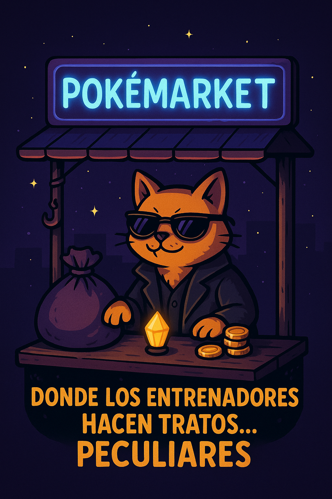
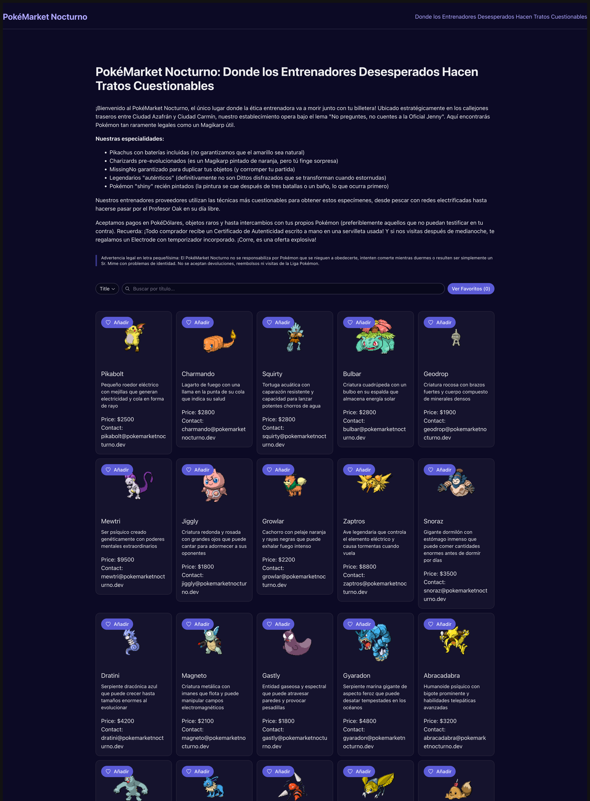

# 🔮 PokéMarket Nocturno

This is a **React SPA** built with **Vite, TypeScript, and Bun** that allows users to **search, view, and favorite items
** from a list served via **Mock Service Worker (MSW)**.



## ✅ Requirements

To run this project, make sure you have:

- **Node.js v20 or later** installed. You can check your version with:

```sh
node -v
```

Bun package manager installed. Follow the installation guide here: [Bun Documentation](https://bun.sh/package-manager)

```sh
curl -fsSL https://bun.sh/install | bash
```

Alternatively, you can install Bun via npm:

```sh
npm install -g bun
```

(Optional) While this project is optimized for Bun, it will work equally well with npm, yarn, or pnpm. However, Bun is
recommended for faster performance.

## 🚀 Features

- 🔎 **Search items** by `type`, `description`, `price`, and `email`
- 📄 **Display a paginated list** of items (5 at a time)
- ⭐ **Add/remove favorites**, which are stored only in memory
- 📜 **Infinite scrolling** to load more items dynamically
- 🖼️ **Responsive design** with an easy-to-use UI
- ⚡ **Optimized performance** (efficient state management)
- ✅ **Tests** using Vitest

---

## 🛠️ Setup & Installation

### **1️⃣ Clone the Repository**

```sh
git clone git@github.com:monicadomigop/pokemarket-nocturno.git
```

### **2️⃣ Install Dependencies with Bun**

```sh
bun install
```

### **3️⃣ Start Dev with Bun**

```sh
bun run dev
```

- The app will be available at **`http://localhost:5173/`**.

---

## 🧪 Running Tests

### **Run All Tests**

```sh
bun run test
```

---

## 📡 Mock API with MSW

This project uses **Mock Service Worker (MSW)** to simulate an API.

### **Starting MSW in Development Mode**

- MSW is automatically enabled when running `bun run dev`.
- The mock API serves **data from `src/mocks/data.json`**.
- If you need to update the API behavior, modify **`src/mocks/handlers.ts`**.

---

## 📂 Project Structure

```
/src
 ├── /components     # UI Components (ItemList, ItemCard, FavoritesModal, Header)
 ├── /contexts       # Context Providers (FavoritesContext)
 ├── /hooks          # Custom Hooks (useFetchItems, useFavorites, etc.)
 ├── /mocks          # Mock API setup with MSW
 ├── /models         # TypeScript interfaces and models
 ├── /services       # API fetch logic
 ├── /tests          # Test utils
 ├── App.tsx         # Main App component
 ├── main.tsx        # Entry point
 └── README.md       # Project documentation
```

## 📖Documentation

For detailed information about **technical decisions** and the **changelog**, refer to:

- 📜 **[Architecture Decision Records (ADRs)](src/docs/adr-000-docs.md)**
- 📌 **[Changelog](CHANGELOG.md)**

---

## 📌 **Available Commands**

| Command           | Description                     |
|-------------------|---------------------------------|
| `bun run dev`     | Start the development server    |
| `bun run build`   | Create a production-ready build |
| `bun run preview` | Preview the production build    |
| `bun run lint`    | Run ESLint to check code style  |
| `bun run test`    | Run the test suite with Vitest  |

---

## 📌 Deployment

To create a production build, run:

```sh
bun run build
```

This will generate an optimized bundle in the `/dist` folder.


---
## Product



---

## Legal Disclaimer

*This project is satirical and does not promote illegal Pokémon trading. All Pokémon should be treated ethically and in accordance with Pokémon League regulations.*

## Contributing

Contributions are welcome but will be reviewed by our "discretion specialists" to maintain the anonymity of our suppliers.

## License

MIT License (or whatever our Meowth lawyer says)

---